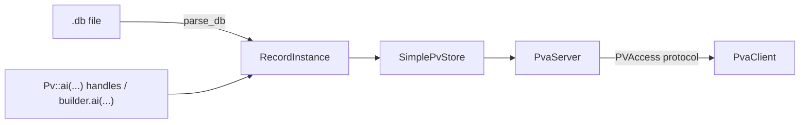
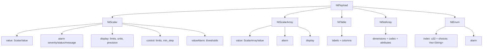
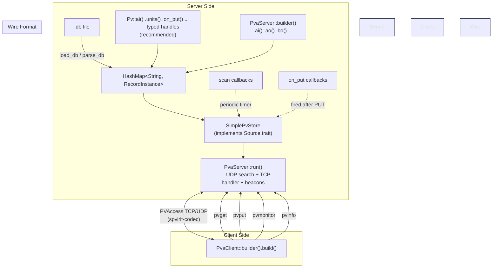

# Spvirit

[](https://crates.io/crates/spvirit-types)
[](https://crates.io/crates/spvirit-codec)
[](https://crates.io/crates/spvirit-client)
[](https://crates.io/crates/spvirit-server)
[](https://crates.io/crates/spvirit-tools)
[](LICENSE)

*/ˈspɪrɪt/ of the Machine* 

Spvirit is a Rust library for working with EPICS PVAccess protocol, including encoding/decoding and connection state tracking. It also includes tools for monitoring and testing PVAccess connections. These are not yet production ready, but they are available for anyone to use and contribute to.

Key areas of development in the near future include:
- Expanding `spvirit-server` with more complete softIOC behaviours and record processing.
- TLS support and structured put payloads in the client.

## Why Rust? 

Because why not, admittedly I just wanted to learn Rust and this seemed like a fun project with a moderately useful outcome.

## Project Structure
The project is structured as a Cargo workspace with six crates:
- `spvirit-types`: Shared data model types for PVAccess Normative Types (NT).
- `spvirit-codec`: PVAccess protocol encoding/decoding logic and connection state tracking.
- `spvirit-client`: Client library — search, connect, get, put, monitor.
- `spvirit-server`: Server library — db parsing, Source trait, PVAccess server runtime.
- `spvirit-tools`: Command-line tools (CLI binaries) for monitoring and testing PVAccess connections.
- `spvirit-py`: Python bindings via PyO3 — client and server APIs accessible from Python.

## Key Concepts

If you're new to EPICS or PVAccess, the terminology can be confusing. This section explains the key concepts and how they map to Spvirit's Rust types.

### PVs, Records, and .db files

In EPICS, a **Process Variable (PV)** is a named data point — a temperature reading, a motor position, or a shutter state. PVs are the things clients read and write over the network.

On the server side, each PV is backed by a **Record**. A record has a **type** (`ai`, `ao`, `bi`, `bo`, `waveform`, etc.) that determines its behaviour: whether it's read-only or writable, what data shape it holds, and what processing it does.

Records are usually declared in **`.db` files** — plain-text configuration files using the EPICS database syntax:

```
record(ai, "SIM:TEMPERATURE") {
    field(DESC, "Simulated sensor")
    field(EGU,  "degC")
    field(PREC, "2")
    field(HOPR, "100")
    field(LOPR, "-20")
}

record(ao, "SIM:SETPOINT") {
    field(DESC, "Target temperature")
    field(EGU,  "degC")
    field(DRVH, "100")
    field(DRVL, "0")
}
```

In Spvirit, a `RecordInstance` holds all of this — the record type, the current value (as a Normative Type), and the common fields. You can build records in code with typed PV handles (`Pv::ai(...)`, recommended), with the classic builder (`PvaServer::builder().ai(...)`), or load them from `.db` files with `.db_file("path.db")`.


```mermaid
flowchart LR
    DB[".db file"] -->|parse_db| RI["RecordInstance"]
    Code["Pv::ai(...) handles / builder.ai(...)"] --> RI
    RI --> Store["SimplePvStore"]
    Store --> Server["PvaServer"]
    Server -->|PVAccess protocol| Client["PvaClient"]
```

### Record Types at a Glance

| Record Type | Rust Builder | Direction | Data Shape | Typical Use |
|---|---|---|---|---|
| `ai` | `.ai(name, f64)` | Input (read-only) | Scalar | Sensor readings |
| `ao` | `.ao(name, f64)` | Output (writable) | Scalar | Setpoints, commands |
| `bi` | `.bi(name, bool)` | Input (read-only) | Boolean | Status bits |
| `bo` | `.bo(name, bool)` | Output (writable) | Boolean | On/off switches |
| `stringin` | `.string_in(name, str)` | Input (read-only) | String | Status messages |
| `stringout` | `.string_out(name, str)` | Output (writable) | String | Text commands |
| `waveform` | `.waveform(name, data)` | Writable | Array | Spectra, traces |
| `aai` | `.aai(name, data)` | Input (read-only) | Array | Read-only array data |
| `aao` | `.aao(name, data)` | Output (writable) | Array | Writable array data |
| `subArray` | `.sub_array(name, data)` | Writable | Array | View into part of an array |
| `mbbi` | `.mbbi(name, choices, idx)` | Input (read-only) | Enum | Multi-choice status |
| `mbbo` | `.mbbo(name, choices, idx)` | Output (writable) | Enum | Multi-choice selector |
| `NtTable` | `.nt_table(name, table)` | Writable | Table | Tabular data |
| `NtNdArray` | `.nt_ndarray(name, arr)` | Writable | NDArray | Image / detector data |
| `generic` | `.generic(name, desc, payload)` | Writable | Arbitrary | Custom structure |

**Input** records are read-only from the client's perspective — values are produced by the server (scan callbacks, hardware, simulation). **Output** records accept writes from PVAccess clients (PUT operations).

### Normative Types (NT)

The PVAccess protocol doesn't send plain numbers — it sends structured payloads called **Normative Types**. These wrap the actual value with rich metadata (alarm state, timestamp, display limits, engineering units, etc.).


```mermaid
flowchart TD
    NTP["NtPayload"]
    NTP --> NTS["NtScalar"]
    NTP --> NTSA["NtScalarArray"]
    NTP --> NTT["NtTable"]
    NTP --> NTNA["NtNdArray"]
    NTP --> NTE["NtEnum"]

    NTS --> V1["value: ScalarValue"]
    NTS --> A1["alarm severity/status/message"]
    NTS --> D1["display: limits, units, precision"]
    NTS --> C1["control: limits, min_step"]
    NTS --> VA1["valueAlarm: thresholds"]

    NTSA --> V2["value: ScalarArrayValue"]
    NTSA --> A2["alarm"]
    NTSA --> D2["display"]

    NTT --> L["labels + columns"]
    NTNA --> DIM["dimensions + codec + attributes"]
    NTE --> V3["index: u32 + choices: Vec&lt;String&gt;"]
    NTE --> A3["alarm"]
```

The five Normative Types in Spvirit:

| Normative Type | Rust Type | Backed by | Used for |
|---|---|---|---|
| NTScalar | `NtScalar` | `ScalarValue` (f64, i32, bool, String, …) | Single-value PVs (`ai`, `ao`, `bi`, `bo`, etc.) |
| NTScalarArray | `NtScalarArray` | `ScalarArrayValue` (Vec\<f64\>, Vec\<i32\>, …) | Array PVs (`waveform`, `aai`, `aao`) |
| NTEnum | `NtEnum` | index (u32) + choices (Vec\<String\>) | Multi-bit binary records (`mbbi`, `mbbo`) |
| NTTable | `NtTable` | Named columns of `ScalarArrayValue` | Tabular data |
| NTNDArray | `NtNdArray` | `ScalarArrayValue` + dimensions + attributes | Image / detector data (areaDetector) |

### Enums in EPICS (bi/bo and ZNAM/ONAM)

EPICS doesn't have a first-class enum type like Rust. Instead, **binary records** (`bi`/`bo`) use two string labels — `ZNAM` (the "zero" name) and `ONAM` (the "one" name) — to map a boolean value to human-readable choices:

```
record(bo, "SHUTTER:CTRL") {
    field(ZNAM, "Closed")
    field(ONAM, "Open")
}
```

When a client reads this PV, the NTScalar's value is the integer index (0 or 1), and the `display.form.choices` field carries `["Closed", "Open"]` so the UI can show a dropdown. In Spvirit, `bi`/`bo` records store the underlying value as `ScalarValue::Bool` and the labels in the `znam`/`onam` fields of `RecordData::Bi` / `RecordData::Bo`.

### How it all fits together


```mermaid
flowchart TD
    subgraph Server Side
        DB[".db file"] -->|load_db / parse_db| Records["HashMap&lt;String, RecordInstance&gt;"]
        Handles["Pv::ai() .units() .on_put() ...
        typed handles (recommended)"] --> Records
        Builder["PvaServer::builder()
        .ai() .ao() .bo() ..."] --> Records
        Records --> Store["SimplePvStore
        (implements Source trait)"]
        Store --> Runtime["PvaServer::run()
        UDP search + TCP handler + beacons"]
        Scan["scan callbacks"] -->|periodic timer| Store
        OnPut["on_put callbacks"] -.->|fired after PUT| Store
    end

    subgraph Client Side
        PC["PvaClient::builder().build()"]
        PC -->|pvget| Runtime
        PC -->|pvput| Runtime
        PC -->|pvmonitor| Runtime
        PC -->|pvinfo| Runtime
    end

    subgraph Wire Format
        Runtime <-->|"PVAccess TCP/UDP
        (spvirit-codec)"| PC
    end

    style Server Side fill:#1a1a2e,stroke:#16213e,color:#e0e0e0
    style Client Side fill:#1a1a2e,stroke:#16213e,color:#e0e0e0
    style Wire Format fill:#0f3460,stroke:#16213e,color:#e0e0e0
```

## Getting Started

### Install Rust 
``` bash
# Linux
curl --proto '=https' --tlsv1.2 -sSf https://sh.rustup.rs | sh
```
### clone the repo
``` bash
git clone https://github.com/ISISNeutronMuon/spvirit
```
### Build the project
``` bash
cd spvirit
cargo build --release
```

### Run the tools
``` bash
cargo run --bin spmonitor my:pv:name
# or
./target/release/spmonitor my:pv:name
# or if installed 
cargo install spvirit-tools

spmonitor my:pv:name
```
### Using the library in your own Rust project

Add the crates you need to your `Cargo.toml`:
```toml
[dependencies]
spvirit-client = "0.1"   # client library: search, connect, get, put, monitor
spvirit-server = "0.1"   # server library: db parsing, Source trait, PVA server
spvirit-codec  = "0.1"   # low-level PVA protocol encode/decode
spvirit-types  = "0.1"   # shared Normative Type data model
spvirit-tools  = "0.1"   # all of the above + CLI tool helpers
```

#### Fetching a PV value (pvget)
```rust
use spvirit_client::PvaClient;

#[tokio::main]
async fn main() -> Result<(), Box<dyn std::error::Error>> {
    let client = PvaClient::builder().build();
    let result = client.pvget("MY:PV:NAME").await?;
    println!("{}: {}", result.pv_name, result.value);
    Ok(())
}
```
```bash
cargo run -p spvirit-client --example pvget
```

#### Writing a value to a PV (pvput)
```rust
use spvirit_client::PvaClient;

#[tokio::main]
async fn main() -> Result<(), Box<dyn std::error::Error>> {
    let client = PvaClient::builder().build();
    client.pvput("MY:PV:NAME", 42.0).await?;
    println!("OK");
    Ok(())
}
```
```bash
cargo run -p spvirit-client --example pvput
```

#### Monitoring a PV for live updates (pvmonitor)
```rust
use std::ops::ControlFlow;
use spvirit_client::PvaClient;

#[tokio::main]
async fn main() -> Result<(), Box<dyn std::error::Error>> {
    let client = PvaClient::builder().build();
    client.pvmonitor("MY:PV:NAME", |value| {
        println!("{value}");
        ControlFlow::Continue(())   // return Break(()) to stop
    }).await?;
    Ok(())
}
```
```bash
cargo run -p spvirit-client --example pvmonitor
```

#### Running a PVAccess server (typed PV handles — recommended)

A `Pv<T>` is a typed handle you create, configure, and keep. Behavior attaches
to the PV itself, and after the server starts you read/write through the
handle — no string lookups, no untyped values:

```rust
use spvirit_server::{AnyPv, Pv, PvaServer};

#[tokio::main]
async fn main() -> Result<(), Box<dyn std::error::Error>> {
    let temp = Pv::ai("SIM:TEMPERATURE", 22.5).units("degC").prec(2);
    let setpoint = Pv::ao("SIM:SETPOINT", 25.0)
        .drive_limits(0.0, 100.0)
        .on_put(|_pv, v: f64| {
            if v.is_finite() { Ok(()) } else { Err("not a number".into()) } // Err rejects the PUT
        });

    let server = PvaServer::serve([AnyPv::from(temp.clone()), AnyPv::from(setpoint)])
        .start()
        .await;

    temp.set(23.1).await?;          // posts to monitors, stamps time, honors MDEL
    let t: f64 = temp.get().await?; // typed read
    println!("temperature: {t}");

    // handles work for .db-loaded records too: server.pv::<f64>("SOME:PV").await?
    server.store(); // deep-end access is still there
    loop {
        tokio::time::sleep(std::time::Duration::from_secs(60)).await;
    }
}
```

Handles are cheap clones, so bulk creation is just a loop:

```rust
let bpms: Vec<Pv<f64>> = (0..100)
    .map(|i| Pv::ai(format!("BPM:{i:03}:X"), 0.0).units("mm"))
    .collect();
let server = PvaServer::serve(bpms.iter().cloned()).start().await;
bpms[42].set(1.23).await?;
```

Every handle-built PV is a real record, so IOC-style field access
(`SIM:TEMPERATURE.RTYP`, `.DESC$`) and MDEL/ADEL deadbands work automatically —
including for the EPICS Archiver Appliance.

#### Running a PVAccess server (classic builder)
```rust
use spvirit_server::PvaServer;

#[tokio::main]
async fn main() -> Result<(), Box<dyn std::error::Error>> {
    let server = PvaServer::builder()
        .ai("SIM:TEMPERATURE", 22.5)
        .ao("SIM:SETPOINT", 25.0)
        .bo("SIM:ENABLE", false)
        .build();

    server.run().await
}
```
```bash
cargo run -p spvirit-server --example simple_server
```

#### Reacting to client writes (`on_put`)
Register a callback that fires whenever a PVAccess client writes to a PV:
```rust
use spvirit_server::PvaServer;

#[tokio::main]
async fn main() -> Result<(), Box<dyn std::error::Error>> {
    let server = PvaServer::builder()
        .ao("SIM:SETPOINT", 25.0)
        .on_put("SIM:SETPOINT", |pv, val| {
            // `val` is a DecodedValue — the raw structure sent by the client
            println!("{pv} was set to {val:?}");
        })
        .build();

    server.run().await
}
```
```bash
cargo run -p spvirit-server --example on_put
```

#### Reading and writing PVs at runtime (`store()`)
The `store()` handle lets your own code read and write PV values while the server is running — useful for simulation loops, hardware I/O, or responding to external events:
```rust
use spvirit_server::PvaServer;
use spvirit_types::ScalarValue;

#[tokio::main]
async fn main() -> Result<(), Box<dyn std::error::Error>> {
    let server = PvaServer::builder()
        .ai("SIM:TEMPERATURE", 22.5)
        .ao("SIM:SETPOINT", 25.0)
        .build();

    let store = server.store().clone();

    // Spawn a task that reads/writes PVs independently
    tokio::spawn(async move {
        loop {
            // Read the current setpoint (like an on_get)
            if let Some(sp) = store.get_value("SIM:SETPOINT").await {
                println!("Current setpoint: {sp:?}");
            }

            // Push a new temperature reading
            store.set_value("SIM:TEMPERATURE", ScalarValue::F64(23.1)).await;

            tokio::time::sleep(std::time::Duration::from_secs(1)).await;
        }
    });

    server.run().await
}
```
```bash
cargo run -p spvirit-server --example store_runtime
```

#### Periodic scan callbacks
Use `.scan()` to produce new values on a timer — the server pushes updates to any monitoring clients automatically:
```rust
use spvirit_server::PvaServer;
use spvirit_types::ScalarValue;
use std::sync::atomic::{AtomicU64, Ordering};
use std::time::Duration;

static TICK: AtomicU64 = AtomicU64::new(0);

#[tokio::main]
async fn main() -> Result<(), Box<dyn std::error::Error>> {
    let server = PvaServer::builder()
        .ai("SIM:TEMPERATURE", 22.5)
        .scan("SIM:TEMPERATURE", Duration::from_millis(100), |_pv| {
            let t = TICK.fetch_add(1, Ordering::Relaxed) as f64;
            ScalarValue::F64(22.5 + (t * 0.1).sin())
        })
        .build();

    server.run().await
}
```
```bash
cargo run -p spvirit-server --example scan_callback
```

#### Serving a waveform (array PV)
```rust
use spvirit_server::PvaServer;
use spvirit_types::ScalarArrayValue;

#[tokio::main]
async fn main() -> Result<(), Box<dyn std::error::Error>> {
    let server = PvaServer::builder()
        .waveform("SIM:SPECTRUM", ScalarArrayValue::F64(vec![0.0; 1024]))
        .build();

    let store = server.store().clone();
    tokio::spawn(async move {
        const N: usize = 1024;
        let mut tick = 0u64;
        loop {
            let phase = (tick as f64) * 0.03;
            let samples = (0..N)
                .map(|i| {
                    let x = i as f64;
                    (phase + x * 0.02).sin() + 0.25 * (phase * 0.5 + x * 0.05).cos()
                })
                .collect::<Vec<_>>();
            store
                .set_array_value("SIM:SPECTRUM", ScalarArrayValue::F64(samples))
                .await;
            tick += 1;
            tokio::time::sleep(std::time::Duration::from_millis(100)).await;
        }
    });

    server.run().await
}
```
```bash
cargo run -p spvirit-server --example waveform
```

#### Building a custom record by hand
For record types not covered by the builder helpers, construct a `RecordInstance` directly and insert it into the store:
```rust
use std::collections::HashMap;
use spvirit_server::{PvaServer, RecordInstance, RecordType, RecordData, DbCommonState};
use spvirit_types::{NtScalar, ScalarValue};

#[tokio::main]
async fn main() -> Result<(), Box<dyn std::error::Error>> {
    // Create a custom ai record with pre-populated fields
    let custom = RecordInstance {
        name: "CUSTOM:SENSOR".into(),
        record_type: RecordType::Ai,
        common: DbCommonState {
            desc: "My custom sensor".into(),
            ..DbCommonState::default()
        },
        data: RecordData::Ai {
            nt: NtScalar::from_value(ScalarValue::F64(21.0))
                .with_units("degC".into())
                .with_precision(2)
                .with_limits(-20.0, 100.0),
            inp: None,
            siml: None,
            siol: None,
            simm: false,
        },
        raw_fields: HashMap::new(),
    };

    let server = PvaServer::builder()
        .ao("CUSTOM:SETPOINT", 25.0)
        .build();

    // Insert the hand-built record into the running store
    server.store().insert("CUSTOM:SENSOR".into(), custom).await;

    server.run().await
}
```
```bash
cargo run -p spvirit-server --example custom_record
```

#### Lower-level NT put/get (`nt_put_get`)

Use this example when you want full Normative Type control rather than
record convenience helpers.

- Run: `cargo run -p spvirit-server --example nt_put_get`
- Source: `spvirit-server/examples/nt_put_get.rs`

When to use NT-level APIs (`put_nt` / `get_nt`):

- You need to write/read full `NtPayload` (not just `.value`).
- You need to set alarm severity/status/message explicitly.
- You need dynamic metadata updates (for example
    `display_description`/ADesc-style text).
- You are working with richer payloads like `NtTable` or `NtNdArray`.

When to use record/value APIs (`set_value` / `set_array_value`):

- You mainly update scalar or array values.
- You want less boilerplate and softIOC-style ergonomics.
- You do not need to manually manage NT metadata fields each update.

### Building the Python wrapper (`spvirit-py`)

The `spvirit-py` crate provides Python bindings via [PyO3](https://pyo3.rs) and is built with [maturin](https://www.maturin.rs/).

#### Prerequisites
- Python 3.9+
- Rust toolchain (see above)
- `maturin` (`pip install maturin`)

#### Development build (editable install)
```bash
cd spvirit/spvirit-py
python -m venv .venv

# Linux / macOS
source .venv/bin/activate
# Windows (PowerShell)
.venv\Scripts\Activate.ps1

pip install maturin
maturin develop --release
```

After `maturin develop` the `spvirit` module is importable from the venv.

#### Typed PV handles (recommended)

A `spvirit.Pv` is a typed handle you create, configure, and keep — mirroring
the Rust `Pv<T>` handle API above. Attach `on_put`/`scan`/`calc` to it, *then*
hand it to `Server(pvs=[...])`; attaching any of these **after** the PV is
served is a silent no-op (the core only logs a tracing warning, it does not
raise):

```python
import spvirit

temp = spvirit.ai("SIM:TEMPERATURE", 22.5, units="degC", prec=2)
setpoint = spvirit.ao("SIM:SETPOINT", 25.0, drive_limits=(0.0, 100.0))

@setpoint.on_put
def _on_setpoint(pv, value):
    if value > 100.0:
        return False  # reject the PUT on the wire

@temp.scan(period=1.0)
def _simulate(pv):
    return pv.get() + 0.1 * (setpoint.get() - pv.get())  # relax toward setpoint

power = spvirit.calc("SIM:POWER", [temp, setpoint], lambda v: max(0.0, v[1] - v[0]))
# calc callbacks that raise (or return a non-float) post 0.0, not the last
# value — asymmetric with .scan(), which re-posts its own cache instead.

# Attach on_put/scan/calc BEFORE this — attaching afterwards is a no-op.
server = spvirit.Server(pvs=[temp, setpoint, power])
server.start()  # background thread; server.run() blocks instead

temp.set(23.1)          # posts to monitors, stamps time, honors MDEL
print(temp.get())       # typed read

# server.pv(name) mints a handle to any served record, including .db-loaded ones
h = server.pv("SIM:TEMPERATURE")
```

`spvirit.pv(name, initial, ...)` infers the record type from `initial`'s
Python type instead of naming a constructor: `bool` -> `bo`, `float` -> `ao`,
`str` -> `string_out`. Plain `int` raises `TypeError` (longin/longout aren't
implemented yet — use a float).

See `spvirit-py/examples/demo_pv_handles.py` for a complete runnable demo.

#### Classic builder

```python
import spvirit

# Client
client = spvirit.ClientBuilder().build()
result = client.pvget("MY:PV:NAME")
print(result)

# Server
builder = spvirit.ServerBuilder()
builder.ai("SIM:TEMPERATURE", 22.5)
builder.ao("SIM:SETPOINT", 25.0)
server = builder.build()
server.run()
```

#### Building a wheel for distribution
```bash
maturin build --release
# wheel is written to target/wheels/
pip install target/wheels/spvirit_py-*.whl
```

#### Running the Python examples
```bash
maturin develop --release
python spvirit-py/examples/demo_server.py
python spvirit-py/examples/demo_nt_access.py
python spvirit-py/examples/demo_pv_handles.py   # typed PV handles (recommended)
```

### Running the examples

All examples can be run directly from the repo:

```bash
# Codec examples
cargo run -p spvirit-codec --example decode_packet          # decode captured packet bytes

# Client examples (need a running PVAccess server on the network)
cargo run -p spvirit-client --example pvget            # fetch a PV
cargo run -p spvirit-client --example pvput            # write a PV
cargo run -p spvirit-client --example pvmonitor         # subscribe to updates

# Server examples (start a PVAccess server on localhost:5075)
cargo run -p spvirit-server --example simple_server     # minimal server
cargo run -p spvirit-server --example mailbox           # p4p SharedPV mailbox equivalent
cargo run -p spvirit-server --example on_put            # on_put callback
cargo run -p spvirit-server --example store_runtime     # runtime get/set via store()
cargo run -p spvirit-server --example get_snapshot      # read full NtPayload snapshots
cargo run -p spvirit-server --example nt_put_get        # lower-level NtPayload put/get
cargo run -p spvirit-server --example exotic_nt         # enum-like scalar + NTTable + NTNDArray
cargo run -p spvirit-server --example scan_callback     # periodic scan
cargo run -p spvirit-server --example waveform          # array PV
cargo run -p spvirit-server --example linked_calc       # linked/calculated records
cargo run -p spvirit-server --example custom_record     # hand-built RecordInstance
cargo run -p spvirit-server --example snake             # snake game with NTNDArray display
cargo run -p spvirit-server --example custom_pvstore    # custom Source with low-level SourceRegistry

# Source-based provider examples
cargo run -p spvirit-server --example multi_source       # multiple Source providers by priority
cargo run -p spvirit-server --example wildcard_source    # dynamic PV creation (SCRATCH:* prefix)
cargo run -p spvirit-server --example json_source        # file-backed persistent PV store
cargo run -p spvirit-server --example aggregate_source   # computed aggregation from raw PVs
cargo run -p spvirit-server --example passthrough_source # middleware/decorator with access control
```

**Quick demo — server + client in two terminals:**
```bash
# Terminal 1: start a server
cargo run -p spvirit-server --example simple_server

# Terminal 2: read a PV from it
cargo run -p spvirit-client --example pvget -- SIM:TEMPERATURE
```

### Tools available

| spvirit tool | EPICS Base equivalent | Description |
|---|---|---|
| `spget` | `pvget` | Fetch the current value of a PV |
| `spput` | `pvput` | Write a value to a PV |
| `spmonitor` | `pvmonitor` | Subscribe to a PV and print value changes |
| `spinfo` | `pvinfo` | Display field/metadata information for a PV |
| `splist` | `pvlist` | List all available PVs on discovered servers |
| `spserver` | `softIoc` | Not fully one-to-one - just a demo, it does parse some db file vocab |
| `spexplore` |  | Interactive TUI to browse servers, select PVs, and monitor values |
| `spsearch` |  | TUI showing PV search network traffic for diagnostics |
| `spsine` |  | Continuously write a sine wave to a PV (demo/testing) |
| `spget_compare` |  | Compare `pvget` results between spvirit and EPICS Base |
| `spdodeca` |  | Server publishing a rotating 3D dodecahedron as an NTNDArray PV |

## Server (softIOC-like experiment)

The `spvirit-server` crate provides a reusable PVAccess server runtime at two levels:

- **High-level**: Use `PvaServer::builder()` to declare typed records (`ai`, `ao`, `bi`, `bo`, `string_in`, `string_out`, `waveform`, `aai`, `aao`, `mbbi`, `mbbo`, `nt_table`, `nt_ndarray`, `generic`, …), register `on_put` callbacks, attach periodic `scan` callbacks, load `.db` files, register custom `Source` providers, and call `.run()`. See the "Running a PVAccess server" example above.
- **Low-level**: Implement the [`Source`] trait to supply your own PV data source. A `Source` decides which PV names it handles (`claim`), serves GET/PUT operations, and provides subscription channels. Multiple sources are composed in a priority-ordered `SourceRegistry` — the first source to claim a name wins. Call `run_pva_server_with_registry` to serve PVs over PVAccess. The bundled `spserver` CLI tool demonstrates this by parsing a limited subset of EPICS `.db` file syntax to serve static PVs.

The `Source` trait replaces the earlier `PvStore` trait, enabling dynamic PV creation, computed values, file-backed persistence, middleware/decorator patterns, and multi-provider composition. See the `multi_source`, `wildcard_source`, `json_source`, `aggregate_source`, and `passthrough_source` examples.

Both levels prove that the encoding/decoding and connection handling logic in `spvirit-codec` is sufficient to implement a server, and they can be used as a starting point for a more full-featured softIOC in the future. (hint hint PRs welcome :))

## Integration test matrix 
I have tested the tools in this repo against the following EPICS PVAccess servers:
- EPICS 
- p4p (pvxs under the hood)
- PvAccessJava

## Related Projects

- [spvirit-scry](https://crates.io/crates/spvirit-scry) — A Rust tool for capturing and analyzing pvAccess EPICS packets.

## References 

I used the following libraries and repos as refernce materials for PVAccess protocol: 

- [pvxs](https://epics-base.github.io/pvxs/)
- [pvAccess Protocol Specification](https://docs.epics-controls.org/en/latest/pv-access/protocol.html)
- [EPICS Base](https://github.com/epics-base/epics-base)
- [PVAshark](https://github.com/george-mcintyre/pvashark)

## GenAI Usage Log

| Section / Area | What Was Done With AI | Plans Ahead |
|---|---|---|
| `spvirit-types` | Hand coded, few types completed with AI, the prettified with AI | keep the same, fairly complete |
| `spvirit-codec` | Most was hand-coded, some restructuring and prettifying was done with AI.  | keep the same, bring in any common helpers, maybe write a siplified API for users |
| `spvirit-tools` | Mostly AI generated, manually coded parts of Put and Get then let the Agents build on top. Client and server logic has been split out into `spvirit-client` and `spvirit-server` crates. | The APIs are now split idiomatically. Continued refinement of high-level convenience functions for put and monitor. |
| `PvaClient` / `PvaServer` | High-level builder-pattern APIs (`PvaClient::builder()`, `PvaServer::builder()`) designed with AI assistance. Wraps protocol-level operations into ergonomic one-liners for get, put, monitor, info, and typed server records. | Extend with more record types, structured put payloads, and TLS support. |
| Testing | I wrote some basic tests, then used GenAI agents to generate more tests and test cases, which I then manually curated and edited. | Suite is fairly comprehensive so I will keep it as is. |
