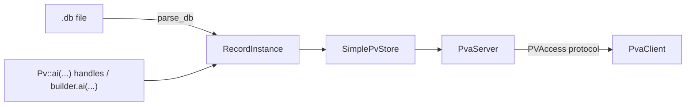
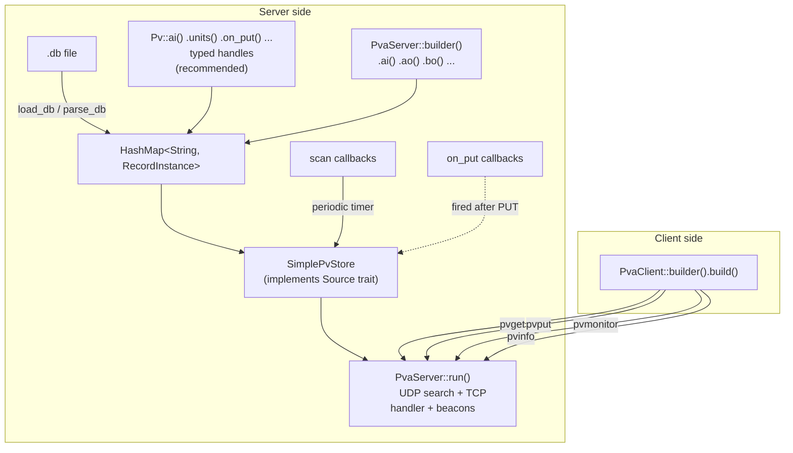

# EPICS in 10 minutes

<!-- verify:begin -->
> ✅ **Verified** · no code on this page · [](https://github.com/ISISNeutronMuon/spvirit/actions/workflows/ci.yml)
>
> The badge reports the whole `docs-verify` suite, not this chapter alone.
<!-- verify:end -->

If you have never met EPICS, the vocabulary is the hard part. There are only
four ideas you need before the rest of this site makes sense.

## PVs

A **Process Variable (PV)** is a named data point — a temperature reading, a
motor position, a shutter state. `SIM:TEMPERATURE` is a PV name. PVs are what
clients read and write over the network, and the name is the only thing a
client needs to find one: there is no host, no port, no path. A client shouts
the name onto the network and whichever server owns it answers.

That is worth pausing on, because it shapes everything else. PV names are a
**flat global namespace**. Conventionally they are colon-separated to imply
hierarchy (`BEAMLINE:SHUTTER:STATE`), but nothing enforces that, and two
servers answering for the same name is a real and confusing failure mode.

## Records

On the server side, each PV is backed by a **Record**. A record has a
**type** — `ai`, `ao`, `bi`, `bo`, `waveform`, and so on — and the type
decides three things: whether clients may write to it, what shape of data it
holds, and what processing happens when it changes.

The naming convention is worth learning because it is not obvious:

- **`i` means input, `o` means output** — from the *IOC's* point of view.
- An **input** record (`ai`, `bi`, `aai`) is read-only to clients. Its value
  comes from the server: a sensor, a scan callback, a simulation.
- An **output** record (`ao`, `bo`, `aao`) accepts client writes.
- **`a` means analog** (a float), **`b` means binary** (a bool), **`mbb`
  means multi-bit binary** (an enum), **`long`** means 32-bit integer, and
  **`waveform`/`aai`/`aao`** are arrays.

So `ai` is "analog input": a read-only float. `bo` is "binary output": a
writable bool.

## Record types at a glance

`PvaServer::builder()` offers fifteen constructors, but they are **not all
the same kind of thing**, and the distinction matters more than the list
does.

### EPICS record types

These are genuine EPICS record types, documented in the [EPICS Base Record
Reference](https://docs.epics-controls.org/projects/base/en/latest/ComponentReference.html)
— the same names, the same `i`/`o` conventions, and the same
[dbCommon](https://docs.epics-controls.org/projects/base/en/latest/dbCommonRecord.html)
fields you would find in an IOC's `.dbd`. They are what you declare in a
`.db` file, they carry alarm limits and deadbands, and the server processes
them: scanning, link evaluation, automatic timestamps, computed severity.

EPICS Base defines 35 record types; Spvirit implements the 14 below. If you
need `calc`, `calcout`, `compress`, `fanout`, `seq`, or the `Direct`
variants, they are not here — though `.link()` covers a good deal of what
people reach for `calc` to do.

| Record type | Rust builder | Direction | Data shape | Typical use |
|---|---|---|---|---|
| `ai` | `.ai(name, f64)` | Input (read-only) | Scalar | Sensor readings |
| `ao` | `.ao(name, f64)` | Output (writable) | Scalar | Setpoints, commands |
| `bi` | `.bi(name, bool)` | Input (read-only) | Boolean | Status bits |
| `bo` | `.bo(name, bool)` | Output (writable) | Boolean | On/off switches |
| `stringin` | `.string_in(name, str)` | Input (read-only) | String | Status messages |
| `stringout` | `.string_out(name, str)` | Output (writable) | String | Text commands |
| `longin` | *(handle only)* | Input (read-only) | Integer | 32-bit counters |
| `longout` | *(handle only)* | Output (writable) | Integer | 32-bit settings |
| `waveform` | `.waveform(name, data)` | Writable | Array | Spectra, traces |
| `aai` | `.aai(name, data)` | Input (read-only) | Array | Read-only array data |
| `aao` | `.aao(name, data)` | Output (writable) | Array | Writable array data |
| `subArray` | `.sub_array(name, data)` | Writable | Array | View into part of an array |
| `mbbi` | `.mbbi(name, choices, idx)` | Input (read-only) | Enum | Multi-choice status |
| `mbbo` | `.mbbo(name, choices, idx)` | Output (writable) | Enum | Multi-choice selector |

### NT-level constructs — not EPICS records

These have no EPICS equivalent. They exist because PVAccess can carry richer
structures than the EPICS record model ever described, and Spvirit lets you
serve those structures directly under a PV name.

| Construct | Rust builder | Normative Type | Typical use |
|---|---|---|---|
| `NtTable` | `.nt_table(name, table)` | NTTable | Tabular data |
| `NtNdArray` | `.nt_ndarray(name, arr)` | NTNDArray | Image / detector data |
| `generic` | `.generic(name, desc, payload)` | any | Custom structure |

The difference is not cosmetic. An `ai` record is a **processing entity**: it
has `SCAN`, `PINI`, `FLNK`, alarm thresholds, and a deadband, and the server
runs a processing model over it. An `NtTable` is a **payload**: a shape on
the wire with a name attached. It has no `SCAN`, no `MDEL`, no alarm
computation, and no `.FIELD` channels, because there is no record underneath
it to have them.

This is the EPICS ideology showing through, and it is worth taking
seriously. EPICS treats a control system as a **distributed database of
records that process** — the record, not the value, is the unit of meaning.
Alarm state, engineering units, and scan behaviour are properties *of the
record*, declared once, and every client sees the same story. Reaching for
`generic` or `nt_ndarray` steps outside that model: you gain the freedom to
send any structure you like, and you give up everything the record layer was
doing on your behalf.

The full trade-off — and when stepping outside is the right call — is
[Records vs raw NT](records-vs-raw-nt.md).

### Two gaps worth knowing before you trip over them

- `sub_array`, `nt_table`, `nt_ndarray`, and `generic` are **builder-only** —
  there is no typed `Pv<T>` handle for them.
- `longin`/`longout` are the reverse: they exist as **typed handles only**
  (`Pv::longin(name, i32)`), not as builder methods, and `.db` loading for
  them is not wired up — `spvirit-server/src/db.rs` carries a `TODO` saying
  so. Declaring a `longin` record in a `.db` file will not give you one.

## Fields

A record is not just a value. It carries **fields**: metadata with
four-letter uppercase names, inherited from EPICS Base.

| Field | Means |
|---|---|
| `DESC` | Description |
| `EGU` | Engineering units (`degC`, `mm`, `counts`) |
| `PREC` | Display precision (decimal places) |
| `HOPR` / `LOPR` | High / low operator display range |
| `DRVH` / `DRVL` | Drive high / low limit — clamps writes |
| `HIHI` / `HIGH` / `LOW` / `LOLO` | Alarm thresholds |
| `MDEL` / `ADEL` | Monitor / archive deadbands |
| `ZNAM` / `ONAM` | Zero name / one name, for binary records |

Clients can read fields individually, QSRV-style, by appending `.FIELD` to
the PV name:

```console
$ spget T:TEMP.EGU
T:TEMP.EGU   2026-08-04 09:36:18.269 degC
```

> **A gap worth knowing about.** Field access only serves two things: the
> **dbCommon** fields every record carries (`DESC`, `SCAN`, `PINI`, `STAT`,
> `SEVR`, `MDEL`, `ADEL`, and about fifteen more), plus any field
> **literally present in a parsed `.db` file**.
>
> Record-specific fields set *programmatically* are not served. If you build
> a PV with `spvirit.ai("X", 22.5, units="degC", prec=2)` or
> `Pv::ai(...).units("degC")`, then `X.EGU` and `X.PREC` do **not** resolve —
> the client times out, because the channel does not exist. The same record
> loaded from a `.db` with `field(EGU, "degC")` serves `X.EGU` fine.
>
> Verified on both paths against `spget`. The cause is in
> `spvirit-server/src/record_fields.rs`: `field_value` consults
> `record.raw_fields`, which is populated by the `.db` parser and left empty
> by the builder and handle APIs. The metadata is still present in the
> NTScalar's `display` structure either way — only the separate `.FIELD`
> channel is missing.

## `.db` files

Records are usually declared in **`.db` files**: plain text, EPICS database
syntax.

```
record(ai, "SIM:TEMPERATURE") {
    field(DESC, "Simulated sensor")
    field(EGU,  "degC")
    field(PREC, "2")
    field(HOPR, "100")
    field(LOPR, "-20")
}

record(ao, "SIM:SETPOINT") {
    field(DESC, "Target temperature")
    field(EGU,  "degC")
    field(DRVH, "100")
    field(DRVL, "0")
}
```

In Spvirit a `RecordInstance` holds all of it — the record type, the current
value as a Normative Type, and the fields. You can build records three ways,
and they mix freely in one server:



## Enums, and the ZNAM/ONAM wart

EPICS has no first-class enum type. **Binary records** (`bi`/`bo`) fake one
with two string labels — `ZNAM` for the zero state, `ONAM` for the one state:

```
record(bo, "SHUTTER:CTRL") {
    field(ZNAM, "Closed")
    field(ONAM, "Open")
}
```

When a client reads this PV the value is the integer index, 0 or 1, and
`display.form.choices` carries `["Closed", "Open"]` so a UI can draw a
dropdown. In Spvirit, `bi`/`bo` store the value as `ScalarValue::Bool` and the
labels in the `znam`/`onam` fields of `RecordData::Bi` / `RecordData::Bo`.

For more than two choices, use `mbbi`/`mbbo`, which take an explicit list of
choices and map to NTEnum properly.

## Channel Access and PVAccess

You will see both names. **Channel Access (CA)** is the original EPICS
protocol; **PVAccess (PVA)** is its successor, and it is what Spvirit
implements. The visible difference is that CA sends bare values while PVA
sends **structured payloads** — value plus alarm plus timestamp plus display
metadata, in one message. That structure is the subject of the
[next chapter](normative-types.md).

Default ports: TCP **5075** for data, UDP **5076** for search and beacons.

## How it fits together



That is the whole vocabulary. Next: what actually travels on the wire.

## Further reading

Spvirit follows EPICS conventions rather than inventing its own, so the
upstream documentation applies directly. When this site and EPICS Base
disagree about what a record type or field means, EPICS Base is right and
this is a bug.

- [EPICS Base Record Reference](https://docs.epics-controls.org/projects/base/en/latest/ComponentReference.html)
  — every record type, field by field. The reference for `ai`, `ao`,
  `waveform`, `mbbi`, `subArray` and the rest.
- [Fields Common to All Record Types](https://docs.epics-controls.org/projects/base/en/latest/dbCommonRecord.html)
  — dbCommon: `DESC`, `SCAN`, `PINI`, `STAT`, `SEVR`, and the others Spvirit
  serves through field access.
- [pvAccess Protocol Specification](https://docs.epics-controls.org/en/latest/pv-access/protocol.html)
  — the wire protocol itself, including the pvData encoding and the default
  ports.
- [pvxs](https://epics-base.github.io/pvxs/) — the modern C++ PVAccess
  implementation Spvirit most closely mirrors, and the one to compare
  against when behaviour is ambiguous.
