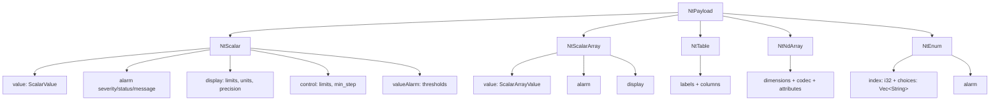

# Normative Types

<!-- verify:begin -->
> ✅ **Verified** · no code on this page · 
>
> The badge reports the whole `docs-verify` suite, not this chapter alone.
<!-- verify:end -->

PVAccess does not send plain numbers. It sends structured payloads called
**Normative Types (NT)**, which wrap the value together with its alarm state,
timestamp, display limits, engineering units, and control metadata — all in
one message.

This is the single biggest difference from Channel Access, and it is why a
`pvget` shows you a timestamp and a severity without a second round trip.

## The five types

| Normative Type | Rust type | Backed by | Used for |
|---|---|---|---|
| NTScalar | `NtScalar` | `ScalarValue` (f64, i32, bool, String, …) | Single-value PVs (`ai`, `ao`, `bi`, `bo`, …) |
| NTScalarArray | `NtScalarArray` | `ScalarArrayValue` (`Vec<f64>`, `Vec<i32>`, …) | Array PVs (`waveform`, `aai`, `aao`) |
| NTEnum | `NtEnum` | index (`i32`) + choices (`Vec<String>`) | Multi-bit binary records (`mbbi`, `mbbo`) |
| NTTable | `NtTable` | Named columns of `ScalarArrayValue` | Tabular data |
| NTNDArray | `NtNdArray` | `ScalarArrayValue` + dimensions + attributes | Image / detector data (areaDetector) |

All five live in `spvirit-types`, and the enum that unifies them is
`NtPayload`. Everything the server sends and the client receives is one of
these.

## What is inside an NTScalar

The value is the small part. An `NtScalar` also carries:

- **alarm** — severity, status, and a message string. Severity is the
  familiar EPICS ladder: `NO_ALARM`, `MINOR`, `MAJOR`, `INVALID`.
- **timeStamp** — seconds past epoch, nanoseconds, and a user tag. The
  server stamps this automatically for IOC-style records.
- **display** — units (`EGU`), precision (`PREC`), display limits
  (`HOPR`/`LOPR`), a description, and a `form` sub-structure whose
  `choices` list is the seven standard display-format names (`Default`,
  `String`, `Binary`, `Decimal`, `Hex`, `Exponential`, `Engineering` — the
  `STANDARD_FORM_CHOICES` static in `spvirit-types`). It does **not** carry
  `ZNAM`/`ONAM`; those `bi`/`bo` state names are stored on the record, not in
  the NTScalar payload.
- **control** — drive limits (`DRVH`/`DRVL`) and a minimum step.
- **valueAlarm** — the `HIHI`/`HIGH`/`LOW`/`LOLO` thresholds the server uses
  to compute severity.

A client does not have to accept all of it. A **pvRequest** lets you ask for
a subset — `value,alarm.severity` — and the server sends only those fields.
That is what the `--fields` flag on the tools does, and it matters for
bandwidth on high-rate monitors.

## Structure IDs

Each NT has a type identifier that goes on the wire:
`epics:nt/NTScalar:1.0`, `epics:nt/NTScalarArray:1.0`,
`epics:nt/NTEnum:1.0`, `epics:nt/NTTable:1.0`, `epics:nt/NTNDArray:1.0`.
Other implementations key off these strings, which is why interop works at
all — and why a hand-built payload with the wrong ID will be misread by
p4p or pvxs even if its fields are perfect.

## Introspection and the FieldDesc cache

Before a client can decode a value it needs the **introspection data**: the
description of the structure's shape. PVAccess sends this once per channel,
assigns it a numeric ID, and thereafter sends only the data — the client
looks the shape up in a cache.

This is why the first `pvget` on a channel is larger than subsequent ones,
and why a server that changes a payload's shape mid-stream will confuse
clients. If you work at the raw-NT level, keep the shape stable for the life
of a channel.

## Next

The two levels at which you can work with these payloads — letting the
record layer manage them for you, or building them by hand — is the subject
of [Records vs raw NT](records-vs-raw-nt.md).
