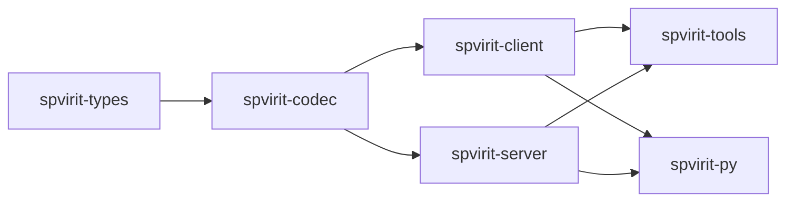

# What is Spvirit?

<!-- verify:begin -->
> ✅ **Verified** · no code on this page · 
>
> The badge reports the whole `docs-verify` suite, not this chapter alone.
<!-- verify:end -->

Spvirit is a Rust implementation of the EPICS **PVAccess** protocol: the wire
codec, a client, a server, a set of command-line tools, and Python bindings.
It talks to EPICS Base, p4p/pvxs, and PVAccessJava, and it needs none of them
installed to build or run.

*/ˈspɪrɪt/ of the Machine*

## Why Rust?

Honestly: the author wanted to learn Rust, and this seemed like a fun project
with a moderately useful outcome. The practical benefits followed — no EPICS
Base build dependency, one static binary per tool, and memory safety in code
that parses untrusted network packets.

## The six crates

The project is a Cargo workspace, strictly layered. Each crate depends only on
the ones above it.

| Crate | What it is |
|---|---|
| `spvirit-types` | Shared data model for PVAccess Normative Types. Pure data, no I/O. |
| `spvirit-codec` | Protocol encoding/decoding and connection state tracking. |
| `spvirit-client` | Search, connect, get, put, monitor. |
| `spvirit-server` | `.db` parsing, the `Source` trait, the PVAccess server runtime. |
| `spvirit-tools` | The command-line tools, and the integration test suites. |
| `spvirit-py` | Python bindings via PyO3 — client and server. |

If you only want to read and write PVs from Rust, you need `spvirit-client`.
If you want to serve them, `spvirit-server`. Both pull in the two layers below
automatically.

## When to reach for it

Spvirit is a good fit when you want to:

- **Read or write PVs from a Rust program** without linking EPICS Base.
- **Stand up a simulator or test double** — a handful of PVs that behave like
  an IOC, in a few lines, started and stopped from a test.
- **Bridge something into PVAccess** — a REST API, a file, a piece of
  hardware with its own protocol — using the `Source` trait.
- **Debug the wire** — the tools hex-dump frames, watch search traffic, and
  byte-compare against captures from other implementations.
- **Drive PVs from Python** without the p4p build chain.

## When not to

Be plain about this: **`spvirit-server` is not a production softIOC
replacement.** It implements the record behaviours that matter for
simulation and testing — values, alarms, deadbands, scan and put callbacks,
links — but it is not EPICS Base. It does not implement the full record
processing model, database links with all their link types, or the
sequencing guarantees a real IOC gives you. If you are running a beamline,
run an IOC.

Development is also ongoing rather than finished. The near-term work is
expanding the server's softIOC behaviours and record processing, and adding
TLS support and structured put payloads to the client.

## Where to go next

- New to EPICS? [EPICS in 10 minutes](epics-in-10-minutes.md).
- Know EPICS, want it running? [Installation](../02-getting-started/install.md).
- Want the internals? The [Developer guide](../06-dev-guide/README.md).
