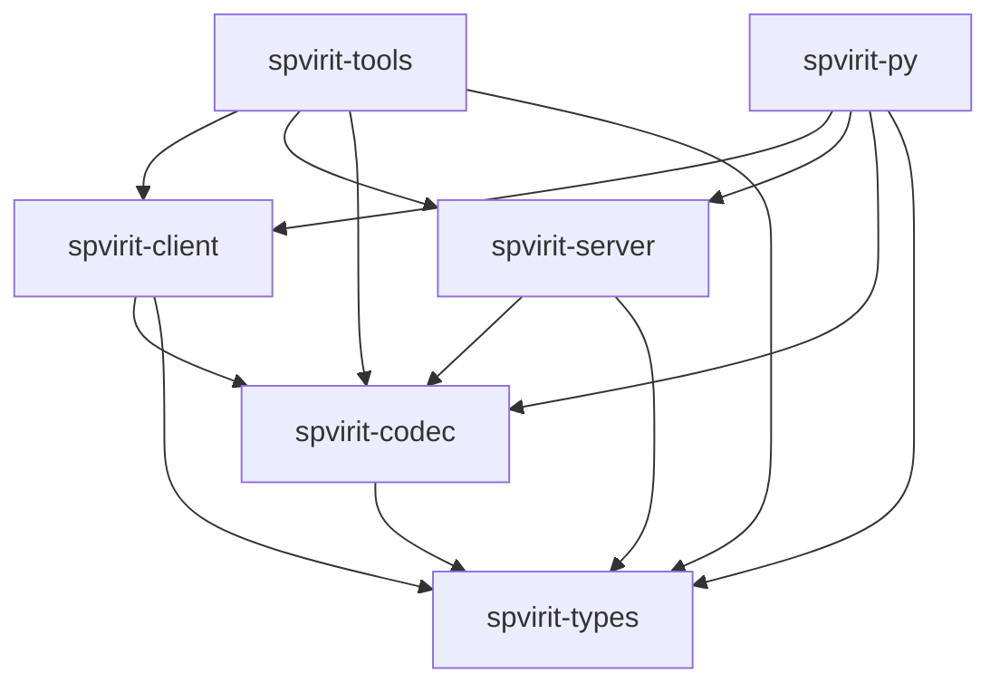

# Crate map

<!-- verify:begin -->
> ✅ **Verified** · no code on this page · 
>
> The badge reports the whole `docs-verify` suite, not this chapter alone.
<!-- verify:end -->

Spvirit is six crates in one workspace. They are published separately, so
you depend on the layer you need and nothing above it.

## The layering

The direction is strict and there are no cycles. `spvirit-client` and
`spvirit-server` do not depend on each other — the only thing they share is
the codec and the type vocabulary underneath it.

## What each one is for

| Crate | Depends on | You want it when |
|---|---|---|
| `spvirit-types` | — | You need the Normative Type structs (`NtScalar`, `NtTable`, `NtNdArray`, `NtEnum`, `ScalarValue`) without any I/O. Pure data and validation. |
| `spvirit-codec` | `spvirit-types` | You are encoding or decoding PVAccess frames yourself — a proxy, an analyser, a test harness. |
| `spvirit-client` | `spvirit-codec` | You are reading, writing, or monitoring PVs from Rust. |
| `spvirit-server` | `spvirit-codec` | You are serving PVs: a soft IOC, a simulator, a gateway. |
| `spvirit-tools` | client + server | You want the `sp*` command-line programs. Also usable as a library, but it exists mainly to ship binaries. |
| `spvirit-py` | client + server | The `spvirit` Python module. A PyO3 extension, not a pure-Python package. |

## Versions

All six are released together from the workspace, so their version numbers
move in step. `spvirit-py` is published to PyPI rather than crates.io and
carries its own version.

## Feature flags

Only `spvirit-tools` is feature-gated:

| Feature | Default | Gates |
|---|---|---|
| `client` | yes | `spget`, `spput`, `spmonitor`, `spinfo`, `splist`, `spsine`, `spget_compare` |
| `server` | yes | `spserver`, `spdodeca` |
| `tui` | yes | `spexplore`, `spsearch`; also required (with `server`) by `sptable` |

All three are on by default. A build with `--no-default-features` produces
**no binaries at all** — a fact worth knowing before you spend ten minutes
wondering where they went. See
[Installation](../02-getting-started/install.md).

`spvirit-types`, `spvirit-codec`, `spvirit-client` and `spvirit-server`
declare no features.

## Where to read further

The [Developer guide](../06-dev-guide/index.md) walks each crate's internals
with file-and-line citations —
[Types and Codec](../06-dev-guide/02-types-and-codec.md),
[Server](../06-dev-guide/03-server.md),
[Client and Tools](../06-dev-guide/04-client-and-tools.md),
[Python Bindings](../06-dev-guide/05-python-bindings.md).
