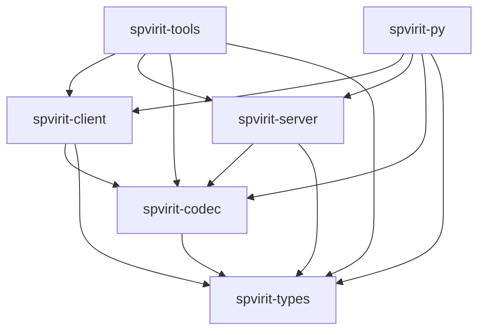

# Crate map

<!-- verify:begin -->
> ✅ **Verified** · no code on this page · 
>
> The badge reports the whole `docs-verify` suite, not this chapter alone.
<!-- verify:end -->

Spvirit is seven crates in one workspace. They are published separately, so
you depend on the layer you need and nothing above it. Six of them form the
layered stack below; the seventh, `spvirit-calc`, stands apart.

## The layering

The direction is strict and there are no cycles. `spvirit-client` and
`spvirit-server` do not depend on each other — the only thing they share is
the codec and the type vocabulary underneath it.

## What each one is for

| Crate | Depends on | You want it when | API docs |
|---|---|---|---|
| `spvirit-types` | — | You need the Normative Type structs (`NtScalar`, `NtTable`, `NtNdArray`, `NtEnum`, `ScalarValue`) without any I/O. Pure data and validation. | [docs.rs](https://docs.rs/spvirit-types/latest/spvirit_types/) |
| `spvirit-codec` | `spvirit-types` | You are encoding or decoding PVAccess frames yourself — a proxy, an analyser, a test harness. | [docs.rs](https://docs.rs/spvirit-codec/latest/spvirit_codec/) |
| `spvirit-client` | `spvirit-codec` | You are reading, writing, or monitoring PVs from Rust. | [docs.rs](https://docs.rs/spvirit-client/latest/spvirit_client/) |
| `spvirit-server` | `spvirit-codec` | You are serving PVs: a soft IOC, a simulator, a gateway. | [docs.rs](https://docs.rs/spvirit-server/latest/spvirit_server/) |
| `spvirit-tools` | client + server | You want the `sp*` command-line programs. Also usable as a library, but it exists mainly to ship binaries. | [docs.rs](https://docs.rs/spvirit-tools/latest/spvirit_tools/) |
| `spvirit-py` | client + server | The `spvirit` Python module. A PyO3 extension, not a pure-Python package. | [Python API](python-api.md) |

A seventh crate, `spvirit-calc`
([docs.rs](https://docs.rs/spvirit-calc/latest/spvirit_calc/)), implements
the EPICS CALC expression language. It is a workspace member and is published
alongside the rest, but nothing in the diagram above depends on it — it stands
alone, and you add it explicitly if you want it.

> **Incomplete.** `spvirit-calc` is a work in progress. Its conformance
> corpus (`spvirit-calc/tests/base_corpus.rs`, transcribed from EPICS Base's
> `epicsCalcTest.cpp`) still has failing cases in the parser's conditional/`:`
> error classification, so that corpus test is currently commented out. The
> per-module unit tests pass, but treat the crate as unfinished. See
> [Known gaps](known-gaps.md).

This book is the tutorial; the docs.rs pages are the exhaustive per-item
reference. They are generated from the same source tree and versioned with
each release, so `latest` always matches the newest published version.

## Versions

All are released together from the workspace, so their version numbers
move in step. `spvirit-py` is published to PyPI rather than crates.io and
carries its own version.

## Feature flags

Only `spvirit-tools` is feature-gated:

| Feature | Default | Gates |
|---|---|---|
| `client` | yes | `spget`, `spput`, `spmonitor`, `spinfo`, `splist`, `spsine`, `spget_compare` |
| `server` | yes | `spserver`, `spdodeca` |
| `tui` | yes | `spexplore`, `spsearch`; also required (with `server`) by `sptable` |

All three are on by default. A build with `--no-default-features` produces
**no binaries at all** — a fact worth knowing before you spend ten minutes
wondering where they went. See
[Installation](../02-getting-started/install.md).

`spvirit-types`, `spvirit-codec`, `spvirit-client` and `spvirit-server`
declare no features.

## Where to read further

The [Developer guide](../06-dev-guide/index.md) walks each crate's internals
with file-and-line citations —
[Types and Codec](../06-dev-guide/02-types-and-codec.md),
[Server](../06-dev-guide/03-server.md),
[Client and Tools](../06-dev-guide/04-client-and-tools.md),
[Python Bindings](../06-dev-guide/05-python-bindings.md).
